# Vegetable Image Dataset
야채 이미지 분류

<br>

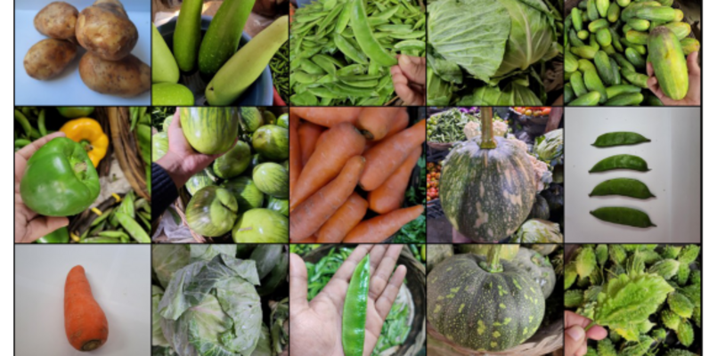

<br>

2024.06.10.

<br></br>
<br></br>
<br></br>
<br></br>
<br></br>

# Ⅰ. 프로젝트 개요
## 1. 프로젝트 목표
야채 재고 관리 시스템의 정확성과 효율성을 향상시키기 위해 야채 종류를 정확히 분류할 수 있는 모델 구현

<br></br>
<br></br>

## 2. 프로젝트 기대효과
✔ 운영 효율성 증대  
자동화된 분류 시스템을 통해 수작업을 줄이고 운영 효율성을 증대함

<br>

✔ 재고 관리 정확성 향상  
정확한 야채 분류를 통해 재고 현황을 정확히 파악하고, 재고 부족을 방지할 수 있음

<br></br>
<br></br>

## 3. 데이터 흐름
### ○ 데이터 분석 프로세스

<br>

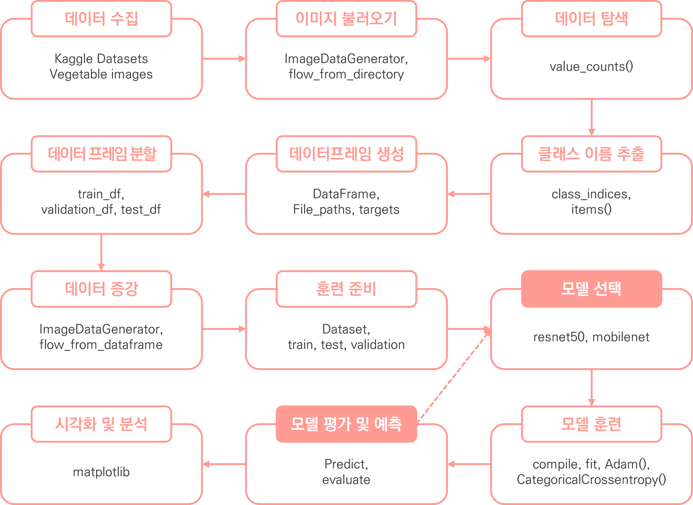


<br></br>
<br></br>

## 4. 데이터 수집
✔ 데이터 정보  
Kaggle의 Vegetable Image Dataset 데이터 세트 활용
https://www.kaggle.com/datasets/misrakahmed/vegetable-image-dataset


<br>

✔ 총 데이터 개수: 16800장 데이터

<br>

✔ 훈련 데이터 세트
| 연번 | target_names | count  |
|:---:|:------------:|:------:|
| 1  | Bean         | 1000   |
| 2  | Brinjal      | 1000   |
| 3  | Broccoli     | 1000 |
| 4 | Cabbage      | 1000 |
| 5 | Capsicum     | 1000 |
| 6 | Carrot       | 1000 |
| 7 | Cauliflower  | 1000 |
| 8 | Cucumber     | 1000 |
| 9 | Potato       | 1000 |
| 10 | Pumpkin      | 1000 |
| 11 | Radish       | 1000 |
| 12 | Tomato       | 1000 |

<br>

✔ 검증 데이터 세트
| 연번 | target_names | count  |
|:---:|:------------:|:------:|
| 1  | Bean         | 200    |
| 2  | Brinjal      | 200    |
| 3  | Broccoli     | 200    |
| 4 | Cabbage      | 200    |
| 5 | Capsicum     | 200    |
| 6 | Carrot       | 200    |
| 7 | Cauliflower  | 200    |
| 8 | Cucumber     | 200    |
| 9 | Potato       | 200    |
| 10 | Pumpkin      | 200    |
| 11 | Radish       | 200    |
| 12 | Tomato       | 200    |

<br>

✔ 테스트 데이터 세트
| 연번 | target_names | count  |
|:---:|:------------:|:------:|
| 1  | Bean         | 200    |
| 2  | Brinjal      | 200    |
| 3  | Broccoli     | 200    |
| 4 | Cabbage      | 200    |
| 5 | Capsicum     | 200    |
| 6 | Carrot       | 200    |
| 7 | Cauliflower  | 200    |
| 8 | Cucumber     | 200    |
| 9 | Potato       | 200    |
| 10 | Pumpkin      | 200    |
| 11 | Radish       | 200    |
| 12 | Tomato       | 200    |


<br>

✔ 이미지

| Bean   | Brinjal | Broccoli |
|:------:|:-------:|:--------:|
|   | 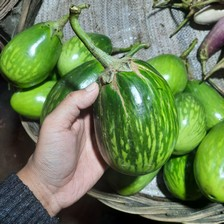    | 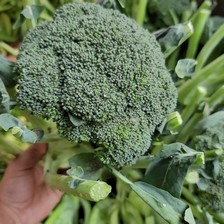     |

| Cabbage   | Capsicum | Carrot |
|:------:|:-------:|:--------:|
|   |     |      |

| Cauliflower   | Cucumber | Potato |
|:------:|:-------:|:--------:|
| 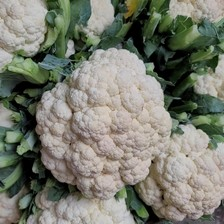  |     | 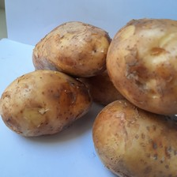     |

| Pumpkin   | Radish | Tomato |
|:------:|:-------:|:--------:|
|   |     |      |

<br></br>
<br></br>
<br></br>
<br></br>
<br></br>

# Ⅱ. 데이터 탐색 및 전처리

## 1. 데이터 전처리
### ○ 이미지 파일명 변경
<details>
  <summary>이미지 경로 code</summary>

  ```
  from glob import glob
  import os

  # 경로 지정
  train_dir = './datasets/train/'
  validation_dir = './datasets/validation/'
  test_dir = './datasets/test/'

  # 해당 경로를 통해 이미지 폴더를 찾아옴
  directories = glob(os.path.join(train_dir, '*'))
  ```
</details>
<details>
  <summary>디렉토리 이름 저장 code</summary>

  ```
  # 폴더 이름 저장할 초기 list 생성
  directory_names = []

  for directory in directories:
      # 디렉토리의 이름을 찾아와서 list에 저장
      directory_names.append(directory[directory.rindex('\\') + 1:])

  print(directory_names)
  ```
</details>
<details>
  <summary>파일명 변경 code</summary>

  ```
  # 이미지 별 폴더 안 이미지들의 파일명 변경
  for name in directory_names:
      for i, file_name in enumerate(os.listdir(os.path.join(train_dir, name))):
          # 이전 파일의 전체 경로
          old_file = os.path.join(train_dir + name + '/', file_name)
          # 신규 파일 전체 경로 작성
          new_file = os.path.join(train_dir + name + '/', name + str(i + 1) + '.png')

          # 이전 파일의 이름을 신규 파일로 변경
          os.rename(old_file, new_file)

  for name in directory_names:
      for i, file_name in enumerate(os.listdir(os.path.join(validation_dir, name))):
          # 이전 파일의 전체 경로
          old_file = os.path.join(validation_dir + name + '/', file_name)
          # 신규 파일 전체 경로 작성
          new_file = os.path.join(validation_dir + name + '/', name + str(i + 1) + '.png')

          # 이전 파일의 이름을 신규 파일로 변경
          os.rename(old_file, new_file)

  for name in directory_names:
      for i, file_name in enumerate(os.listdir(os.path.join(test_dir, name))):
          # 이전 파일의 전체 경로
          old_file = os.path.join(test_dir + name + '/', file_name)
          # 신규 파일 전체 경로 작성
          new_file = os.path.join(test_dir + name + '/', name + str(i + 1) + '.png')

          # 이전 파일의 이름을 신규 파일로 변경
          os.rename(old_file, new_file)
  ```
</details>

<br></br>

### ○ 데이터 프레임 변환
<details>
  <summary>이미지 전처리 code</summary>

  ```
  from tensorflow.keras.preprocessing.image import ImageDataGenerator

  # 이미지 사이즈 및 배치 사이즈
  IMAGE_SIZE = 244
  BATCH_SIZE = 244

  # 이미지 전처리 객체 선언
  idg = ImageDataGenerator()

  # 경로를 통해 이미지 불러온 후 이미지 전처리 진행
  train_generator = idg.flow_from_directory(train_dir,
                                            target_size=(IMAGE_SIZE, IMAGE_SIZE),
                                            batch_size=BATCH_SIZE,
                                            class_mode='categorical',
                                            shuffle=True)

  # 경로를 통해 이미지 불러온 후 이미지 전처리 진행
  validation_generator = idg.flow_from_directory(validation_dir,
                                                target_size=(IMAGE_SIZE, IMAGE_SIZE),
                                                batch_size=BATCH_SIZE,
                                                class_mode='categorical')

  # 경로를 통해 이미지 불러온 후 이미지 전처리 진행
  test_generator = idg.flow_from_directory(test_dir,
                                          target_size=(IMAGE_SIZE, IMAGE_SIZE),
                                          batch_size=BATCH_SIZE,
                                          class_mode='categorical')

  # 각 클랙스의 이름과 인덱스 출력
  print(train_generator.class_indices)
  print(validation_generator.class_indices)
  print(test_generator.class_indices)
  ```
</details>
<details>
  <summary>타겟 고유값 저장 code</summary>

  ```
  # 각 타겟의 타겟 이름을 담기 위해 key와 value의 순서 변경하여 타겟의 고유값을 저장
  target_name = {v: k for k, v in train_generator.class_indices.items()}
  target_name
  ```
</details>
<details>
  <summary>타겟 이름 저장 code</summary>

  ```
  # 각 타겟의 이름 담을 초기 list 선언
  tarin_target_names = []
  validation_target_names = []
  test_target_names = []

  # 각 타겟의 인덱스를 확인하여 인덱스에 맞는 타겟 이름을 담아주기
  for target in train_generator.classes:
      tarin_target_names.append(target_name[target])

  for target in validation_generator.classes:
      validation_target_names.append(target_name[target])

  for target in test_generator.classes:
      test_target_names.append(target_name[target])

  # 각 타겟의 개수 확인
  print(tarin_target_names.__len__(), validation_target_names.__len__(), test_target_names.__len__())
  ```
</details>
<details>
  <summary>데이터 프레임 생성code</summary>

  ```
  import pandas as pd

  # 파일 경로와 타겟값을 가지고 새로운 데이터 프레임 생성 후
  # 경로 중 \\(역슬래시)로 되어 있는 부분을 /(슬래시)로 변경
  train_df = pd.DataFrame({'file_paths': train_generator.filepaths, 'target_names': tarin_target_names, 'targets': train_generator.classes})
  train_df.file_paths = train_df.file_paths.apply(lambda x: x.replace('\\', '/'))

  validation_df = pd.DataFrame({'file_paths': validation_generator.filepaths, 'target_names': validation_target_names, 'targets': validation_generator.classes})
  validation_df.file_paths = validation_df.file_paths.apply(lambda x: x.replace('\\', '/'))

  test_df = pd.DataFrame({'file_paths': test_generator.filepaths, 'target_names': test_target_names, 'targets': test_generator.classes})
  test_df.file_paths = test_df.file_paths.apply(lambda x: x.replace('\\', '/'))

  display(train_df)
  display(validation_df)
  display(test_df)
  ```
</details>

<br></br>
<br></br>

## 2. 데이터 탐색
### ○ 타겟 비중

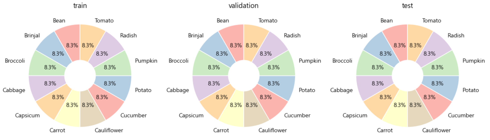
<details>
  <summary>value counts code</summary>

  ```
  # 타겟 데이터 비중 확인
  train_target = train_df.target_names.value_counts().reset_index()
  validation_target = validation_df.target_names.value_counts().reset_index()
  test_target = test_df.target_names.value_counts().reset_index()
  ```
</details>
<details>
  <summary>그래프 code</summary>

  ```
  # 타겟 데이터 비중 변경 전/후 차이 그래프 확인
  fig, axes = plt.subplots(1, 3, figsize=(12,5))

  # 부채꼴 스타일
  wedgeprops = {'width': 0.7, 'edgecolor': 'w', 'linewidth': 1}

  # 컬러맵 가져오기
  cmap = plt.get_cmap('Pastel1')
  # 컬러맵의 색상 선택
  outer_colors = cmap(np.array([0, 1, 2, 3, 4, 5, 6]))

  train_counts = train_target['count']
  train_labels = train_target['target_names']
  val_counts = validation_target['count']
  val_labels = validation_target['target_names']
  test_counts = test_target['count']
  test_labels = test_target['target_names']

  # 그래프 그리기
  axes[0].pie(train_counts, labels=train_labels, colors=outer_colors, autopct='%1.1f%%', startangle=90, wedgeprops=wedgeprops)
  axes[0].set_title('train')
  axes[1].pie(val_counts, labels=val_labels, colors=outer_colors, autopct='%1.1f%%', startangle=90, wedgeprops=wedgeprops)
  axes[1].set_title('validation')
  axes[2].pie(test_counts, labels=test_labels, colors=outer_colors, autopct='%1.1f%%', startangle=90, wedgeprops=wedgeprops)
  axes[2].set_title('test')

  plt.tight_layout()
  plt.show()
  ```
</details>

<br></br>

### ○ class 및 def 선언

<details>
  <summary>데이터세트 생성 class 정의 code</summary>

  ```
  import numpy as np
  from tensorflow.keras.utils import Sequence
  from sklearn.utils import shuffle
  import cv2

  # 데이터 세트 생성 class 정의
  class Dataset(Sequence):
      # 클래스의 초기화
      # 경로, 타겟, 배치 크기, albumentations 객체, 전처리 하마, 셔플 여부를 인자로 받음
      def __init__(self, file_paths, targets, batch_size=BATCH_SIZE, aug=None, preprocess=None, shuffle=False):
          self.file_paths = file_paths
          self.targets = targets
          self.batch_size = batch_size
          self.aug = aug
          self.preprocess = preprocess
          self.shuffle = shuffle

          # shuffle True 시 진행:
          if self.shuffle:
              # epoch 끝날 때마다 호출
              self.on_epoch_end()

      # 전체 데이터 세트 크기 반환
      def __len__(self):
          # 하나의 배치 사이즈에 필요한 데이터 개수 리턴
          return int(np.ceil(len(self.targets) / self.batch_size))

      # 주어진 인덱스에 해당하는 배치 반환
      def __getitem__(self, index):
          # 파일 경로와 타겟 데이터를 배치 크기만큼 자르고, 이미지를 불러와 처리한 후 배치로 반환
          file_paths_batch = self.file_paths[index * self.batch_size: (index + 1) * self.batch_size]
          targets_batch = self.targets[index * self.batch_size: (index + 1) * self.batch_size]

          # 데이터 배치 저장
          results_batch = np.zeros((file_paths_batch.shape[0], IMAGE_SIZE, IMAGE_SIZE, 3))

          # 데이터 수만큼 반복
          for i in range(file_paths_batch.shape[0]):
              # RGB로 색상 형식을 변환하여 이미지 가져오기
              image = cv2.cvtColor(cv2.imread(file_paths_batch[i]), cv2.COLOR_BGR2RGB)
              # 이미지 크기 조정
              image = cv2.resize(image, (IMAGE_SIZE, IMAGE_SIZE))

              # albumentations이 있다면:
              if self.aug is not None:
                  # Augmentor 객체로 이미지 변환
                  image = self.aug(image=image)['image']

              # 전처리 함수가 있다면:
              if self.preprocess is not None:
                  # 이미지 전처리 진행
                  image = self.preprocess(image)

              # 결과 배치에 이미지를 저장
              results_batch[i] = image

          # 결과 배치와 타겟 배치를 반환
          return results_batch, targets_batch
          
      def on_epoch_end(self):
          # shuffle 옵션이 켜져있다면, 데이터를 섞기
          if self.shuffle:
              # epoch 끝날 때마다 데이터 섞기
              self.file_paths, self.targets = shuffle(self.file_paths, self.targets)
  ```
</details>
<details>
  <summary>데이터 세트 함수 code</summary>

  ```
  def create_dataset(paths, targets, BATCH_SIZE, shuffle=True):   
      return Dataset(paths,
                    targets,
                    batch_size=BATCH_SIZE,
                    shuffle=True)
  ```
</details>
<details>
  <summary>이미지 출력 함수 code</summary>

  ```
  # 이미지 출력 함수 선언
  def show_image(image):
      plt.figure(figsize=(3, 3))
      plt.imshow(image)
      plt.axis('off')
  ```
</details>
<details>
  <summary>이미지(다중) 출력 함수 code</summary>

  ```
  import matplotlib.pyplot as plt

  def show_images(files_batch, ncols=4, title=None):    
      figure, axs = plt.subplots(figsize=(22, 4), nrows=1, ncols=ncols)
      
      for i in range(ncols):
          # files_batch는 float이므로 int로 변경
          axs[i].imshow(np.array(files_batch[i], dtype='int32'))
          axs[i].axis('off')
          axs[i].set_title(title[i]) 
  ```
</details>
<details>
  <summary>예측 code</summary>

  ```
  import numpy as np
  from tensorflow.keras.preprocessing.image import img_to_array
  import matplotlib.pyplot as plt

  from tensorflow.keras.applications.vgg16 import VGG16, decode_predictions as vgg16_decode_predictions
  from tensorflow.keras.applications.resnet_v2 import ResNet50V2, decode_predictions as resnet50v2_decode_predictions
  from tensorflow.keras.applications.xception import Xception, decode_predictions as xception_decode_predictions
  from tensorflow.keras.applications.mobilenet_v2 import MobileNetV2, decode_predictions as mobilenetv2_decode_predictions

  def predict_and_display(images, titles, model_name):
      figure, axs = plt.subplots(figsize=(22, 4), nrows=1, ncols=len(images))

      # VGG16 모델 선택
      if model_name == 'vgg16':
          model = VGG16()
          decode_predictions = vgg16_decode_predictions
          target_size = (224, 224)
      # ResNet50V2 모델 선택
      elif model_name == 'resnet50': # ResNet50, 74.9% ; ResNet50V2, 76.0%
          model = ResNet50V2()
          decode_predictions = resnet50v2_decode_predictions
          target_size = (224, 224)
      # Xception 모델 선택
      elif model_name == 'xception': # Inception을 기초로 한 모델
          model = Xception()
          decode_predictions = xception_decode_predictions
          target_size = (299, 299)
      # MobileNetV2 모델 선택
      elif model_name == 'mobilenet':
          model = MobileNetV2()
          decode_predictions = mobilenetv2_decode_predictions
          target_size = (224, 224)

      for i, image in enumerate(images):
          # 모델 입력 크기에 맞게 이미지 크기 조정
          resized_image = cv2.resize(image, target_size)
          # 이미지 배열로 변환
          image_array = img_to_array(resized_image)
          # 차원 확장 (배열의 첫 번째 차원 확장)
          image_array = np.expand_dims(image_array, axis=0)
          # 이미지 예측
          prediction = model.predict(image_array)
          # 이미지 분류 모델의 예측 결과를 해석
          target = decode_predictions(prediction)
          # 높은 확률로 예측 된 클래스 이름과 확률
          predicted_class = target[0][0][1]
          predicted_probability = np.round(target[0][0][2] * 100, 2)
          
          # 이미지와 예측 결과 표시
          axs[i].imshow(image.astype('int'))
          axs[i].axis('off')
          axs[i].set_title(f"{predicted_class}\n{predicted_probability}%")

          print(target)
  ```
</details>
<details>
  <summary>모델 생성 함수 code</summary>

  ```
  from tensorflow.keras.models import Model
  from tensorflow.keras.layers import Input, Dense , Conv2D , Dropout , Flatten , Activation, MaxPooling2D , GlobalAveragePooling2D
  from tensorflow.keras.layers import BatchNormalization

  from tensorflow.keras.applications import VGG16
  from tensorflow.keras.applications import ResNet50V2
  from tensorflow.keras.applications import Xception
  from tensorflow.keras.applications import MobileNetV2 # 작은 장치에서도 성능을 끌어올릴 수 있는 모델

  # 모델 생성 함수 선언
  # model_name: 사전 훈련 모델 이름, verbose: 모델 요약 출력 여부
  def create_model(model_name='vgg16', verbose=False):
      # Input layer: 이미지 크기와 채널 수를 지정
      input_tensor = Input(shape=(IMAGE_SIZE, IMAGE_SIZE, 3))
      # VGG16 모델 선택
      if model_name == 'vgg16':
          model = VGG16(input_tensor=input_tensor, include_top=False, weights='imagenet')
      # ResNet50V2 모델 선택
      elif model_name == 'resnet50': # ResNet50, 74.9% ; ResNet50V2, 76.0%
          model = ResNet50V2(input_tensor=input_tensor, include_top=False, weights='imagenet')
      # Xception 모델 선택
      elif model_name == 'xception': # Inception을 기초로 한 모델
          model = Xception(input_tensor=input_tensor, include_top=False, weights='imagenet')
      # MobileNetV2 모델 선택
      elif model_name == 'mobilenet':
          model = MobileNetV2(input_tensor=input_tensor, include_top=False, weights='imagenet')

      # output layer: 모델 출력 층 
      x = model.output

      # 분류기
      # GlobalAveragePooling2D: 글로벌 평균 풀링 층을 추가하여 특성 맵의 공간 차원 축소
      x = GlobalAveragePooling2D()(x)
      # hidden layer: VGG16 모델 선택을 선택하지 않았다면 dropout 미진행
      if model_name != 'vgg16':
          x = Dropout(rate=0.5)(x)

      # hidden layer: 50개의 뉴런과 ReLU 활성화 함수 사용
      x = Dense(50, activation='relu')(x)

      # hidden layer: VGG16 모델 선택을 선택하지 않았다면 dropout 미진행
      if model_name != 'vgg16':
          x = Dropout(rate=0.5)(x)

      # output layer: 12개의 뉴런과 활성화 함수를 사용하여 클래스 확률 출력
      output = Dense(12, activation='softmax', name='output')(x)

      # 모델 생성: 입력과 출력을 지정하여 모델 정의
      model = Model(inputs=input_tensor, outputs=output)

      # verbose가 True인 경우 모델 요약 출력
      if verbose:
          model.summary()
      
      return model
  ```
</details>

<br></br>

### ○ 유사도 예측
✔ 정답

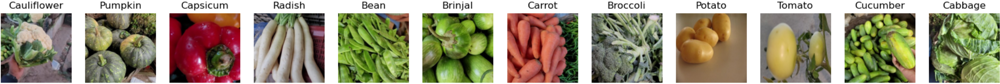

<details>
  <summary>데이터 전처리 및 데이터세트 생성 code</summary>

  ```
  import albumentations as A

  # 이미지 사이즈 및 배치 사이즈
  IMAGE_SIZE = 244
  BATCH_SIZE = 244

  # 각 클래스에서 하나씩 이미지를 샘플링하여 균등한 배치 구성
  sampled_df = test_df.groupby('targets', group_keys=False).apply(lambda x: x.sample(1))

  # 데이터 경로 및 타겟 담기 (get_dummies를 통해 원-핫 인코딩 진행)
  sampled_file_paths = sampled_df['file_paths'].values
  sampled_targets = pd.get_dummies(sampled_df['targets']).values # CategoricalCrossEntropy

  # 이미지 변환 (증강)
  aug = A.Compose([
      # 크기 조정 및 회전
      A.ShiftScaleRotate(p=0.5),
      # 좌우 반전
      A.HorizontalFlip(p=0.5),
      # 밝기 및 대비 변경
      A.RandomBrightnessContrast(brightness_limit=0.2, contrast_limit=0, p=0.5)
  ])

  dataset = create_dataset(sampled_file_paths, sampled_targets, BATCH_SIZE, shuffle=True)
  ```
</details>
<details>
  <summary>이미지 호출 code</summary>

  ```
  # datasets 객체에서 배치 이미지를 불러온 후 각 변수에 저장
  # iter: 반복 가능한 객체를 이터레이터(값을 순차적으로 반환하는 객체)로 변환
  # next: 이터레이터 객체에서 값을 하나씩 가져오고 가져올 값이 없다면 StopIteration 예외 발생 
  files_batch, targets_batch = next(iter(dataset))
  # 레이블 인코딩시, target 차원을 2차원으로 맞춰줘야 한다.
  print(files_batch.shape, targets_batch.shape)
  ```
</details>
<details>
  <summary>정답 출력 code</summary>

  ```
  # 이미지 제목 생성
  titles = [target_name[np.argmax(target)] for target in targets_batch]

  # 정답 출력
  show_images(files_batch, ncols=12, title=titles)
  ```
</details>

<br>

✔ vgg16

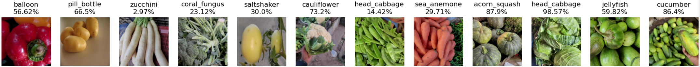

<br>

✔ resnet50

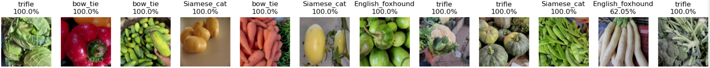

<br>

✔ xception

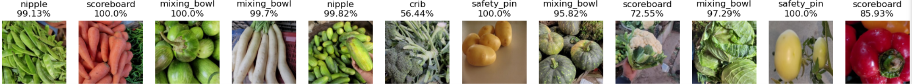
<br>

✔ mobilenet

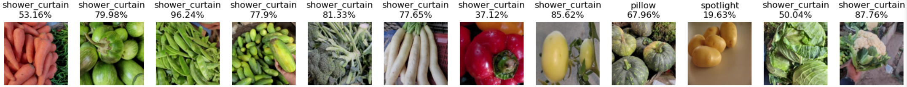

<br></br>

### ○ 분석
✔ vgg16, resnet50, xception, mobilenet 모델을 사용하여 유사도 분석 진행

✔ 유사도 분석 진행 결과 50% 이상 맞추는 모델이 없었으며, 유사도가 낮은 것으로 나타남

<br></br>
<br></br>
<br></br>
<br></br>
<br></br>

# Ⅲ. 딥러닝
## 1. 1cycle
### ○ 훈련 준비
✔ 대용량 데이터 세트이기 때문에 이미지 사이즈를 150, 배치 사이즈를 64로 조정

✔ 높은 정확성과 효율을 보이는 renset50 모델을 채택

✔ 다양한 상황을 고려하기 위해 이미지를 변환하여 데이터를 증강  
특히, 이미지 사진 촬영 환경이 다를 수 있기 때문에 밝기 및 대비 변경을 통해 이상을 방지할 수 있게 조정함

<br>

<details>
  <summary>이미지 및 배치 사이즈 code</summary>

  ```
  # 이미지 사이즈 및 배치 사이즈
  IMAGE_SIZE = 150
  BATCH_SIZE = 64
  ```
</details>
<details>
  <summary>전처리 code</summary>

  ```
  import albumentations as A

  # 데이터 경로 및 타겟 담기
  train_file_paths = train_df['file_paths'].values
  train_targets = pd.get_dummies(train_df['targets']).values # CategoricalCrossEntropy

  validation_file_paths = validation_df['file_paths'].values
  validation_targets = pd.get_dummies(validation_df['targets']).values # CategoricalCrossEntropy

  test_file_paths = test_df['file_paths'].values
  test_targets = pd.get_dummies(test_df['targets']).values # CategoricalCrossEntropy

  # 이미지 변환 (증강)
  aug = A.Compose([
      # 크기 조정 및 회전
      A.ShiftScaleRotate(p=0.5),
      # 좌우 반전
      A.HorizontalFlip(p=0.5),
      # 밝기 및 대비 변경
      A.RandomBrightnessContrast(brightness_limit=0.2, contrast_limit=0, p=0.5)
  ])
  ```
</details>
<details>
  <summary>데이터세트 생성 code</summary>

  ```
  # Dataset class로 객체 생성
  train_dataset = create_dataset(train_file_paths, train_targets, BATCH_SIZE, 'resnet50', shuffle=True)
  validation_dataset = create_dataset(validation_file_paths, validation_targets, BATCH_SIZE, 'resnet50', shuffle=False)
  test_dataset = create_dataset(test_file_paths, test_targets, BATCH_SIZE, 'resnet50', shuffle=False)
  ```
</details>
<details>
  <summary>옵션 조정 code</summary>

  ```
  from tensorflow.keras.callbacks import ModelCheckpoint, ReduceLROnPlateau, EarlyStopping

  # weights 저장
  mcp_cb = ModelCheckpoint(
      filepath="./callback_files/2cycle/weights.{epoch:03d}-{val_loss:.4f}-{acc:.4f}.weights.h5",
      monitor='val_loss',
      save_best_only=False,
      save_weights_only=True,
      mode='min'
  )

  # 일정 기간 동안 성능이 개선되지 않을 시 학습률 동적으로 감소
  rlr_cb = ReduceLROnPlateau(
      monitor='val_loss',
      factor=0.1,
      patience=2,
      mode='min'
  )

  # 일정 기간 동안 성능이 개선되지 않을 시 학습 조기 중단
  ely_cb = EarlyStopping(
      monitor='val_loss',
      patience=4,
      mode='min'
  )
  ```
</details>
<details>
  <summary>모델 생성 및 학습 프로세스 설정 code</summary>

  ```
  from tensorflow.keras.losses import SparseCategoricalCrossentropy, CategoricalCrossentropy, BinaryCrossentropy
  from tensorflow.keras.optimizers import Adam
  from tensorflow.keras.metrics import Accuracy

  # 모델 생성 함수를 사용하여 모델 생성
  model = create_model(model_name='resnet50', verbose=True)

  # 모델 컴파일: 학습 프로세스 설정
  # optimizer: 최적화 알고리즘, loss: 손실함수, metrics: 성능지표
  model.compile(optimizer=Adam(), loss=CategoricalCrossentropy(), metrics=['acc'])
  ```
</details>
<details>
  <summary>메모리 관리 code</summary>

  ```
  import gc 

  gc.collect()
  ```
</details>

<br></br>

### ○ 훈련
✔ 총 9,105초 소요

✔ 50번의 에포크 중 19번째 에포크에서 EarlyStopping 작동


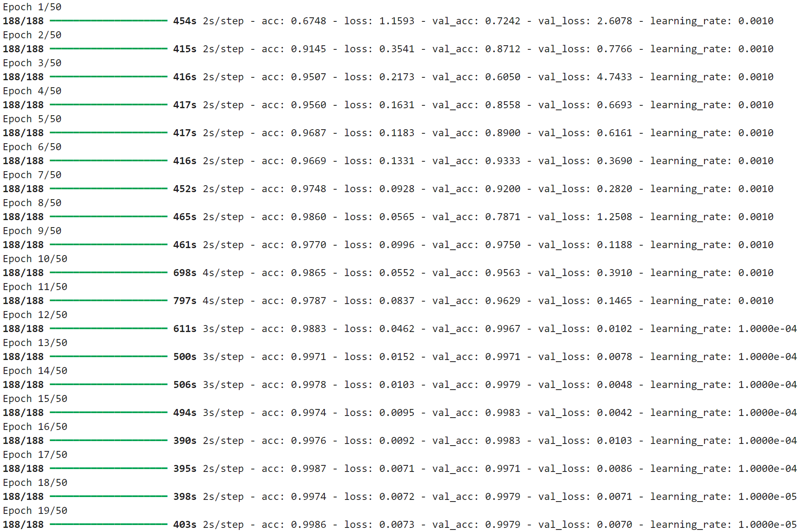

<details>
  <summary>code</summary>

  ```
  # 반복횟수 지정
  # 대문자로 상수를 표기하면 다른 부분에서 변경되지 않는다는 것을 의미
  N_EPOCHS = 50

  # 훈련
  history = model.fit(train_dataset,
                      batch_size=BATCH_SIZE,
                      epochs=N_EPOCHS, 
                      validation_data=validation_dataset,
                      callbacks=[mcp_cb, rlr_cb, ely_cb])
  ```
</details>

<br></br>

### ○ 평가
✔ acc: 0.9979, loss: 0.0052

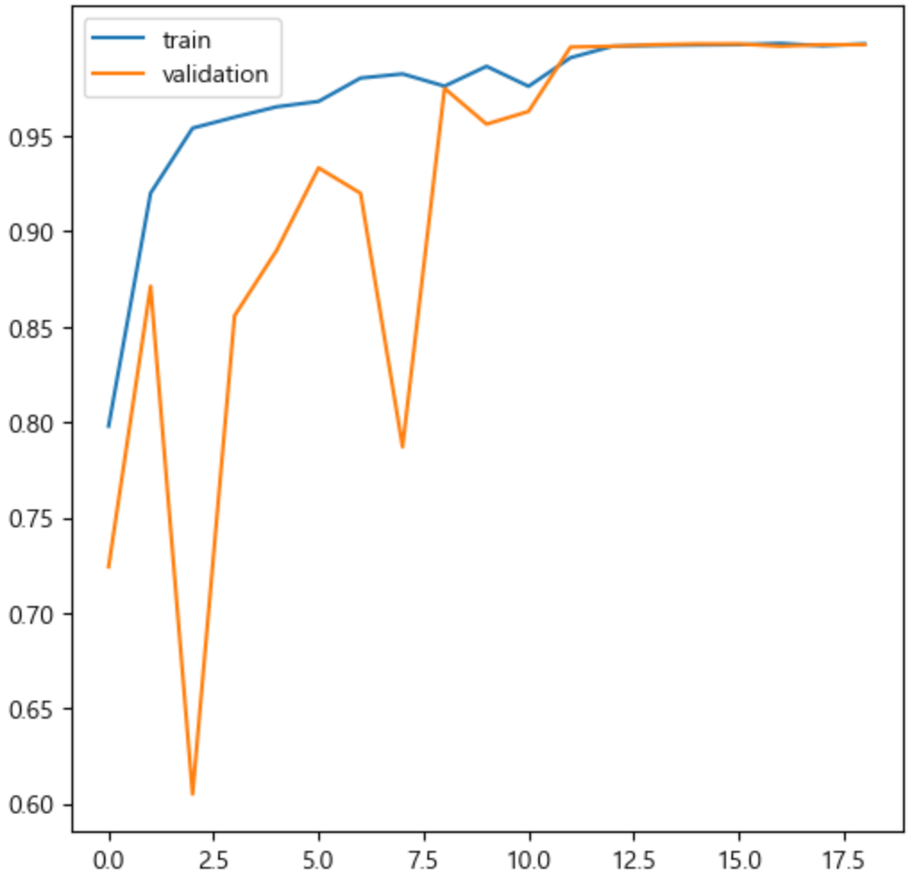

<details>
  <summary>평가 code</summary>

  ```
  # 평가
  model.evaluate(test_dataset, batch_size=BATCH_SIZE)
  ```
</details>
<details>
  <summary>그래프 code</summary>

  ```
  import numpy as np
  import matplotlib.pyplot as plt

  # 학습과정 지표를 그래프화
  def show_history(history):
      plt.figure(figsize=(6, 6))
      plt.yticks(np.arange(0, 1, 0.05))
      plt.plot(history.history['acc'], label='train')
      plt.plot(history.history['val_acc'], label='validation')
      plt.legend()
      
  show_history(history)
  ```
</details>

<br></br>
<br></br>

## 2. 2cycle
### ○ 훈련 준비
✔ 타 모델을 사용하여 성능을 확인

✔ 경량성과 효율성이 뛰어난 mobilenet 모델 채택

<br>

<details>
  <summary>이미지 및 배치 사이즈 code</summary>

  ```
  # 이미지 사이즈 및 배치 사이즈
  IMAGE_SIZE = 150
  BATCH_SIZE = 64
  ```
</details>
<details>
  <summary>전처리 code</summary>

  ```
  import albumentations as A

  # 데이터 경로 및 타겟 담기
  train_file_paths = train_df['file_paths'].values
  train_targets = pd.get_dummies(train_df['targets']).values # CategoricalCrossEntropy

  validation_file_paths = validation_df['file_paths'].values
  validation_targets = pd.get_dummies(validation_df['targets']).values # CategoricalCrossEntropy

  test_file_paths = test_df['file_paths'].values
  test_targets = pd.get_dummies(test_df['targets']).values # CategoricalCrossEntropy

  # 이미지 변환 (증강)
  aug = A.Compose([
      # 크기 조정 및 회전
      A.ShiftScaleRotate(p=0.5),
      # 좌우 반전
      A.HorizontalFlip(p=0.5),
      # 밝기 및 대비 변경
      A.RandomBrightnessContrast(brightness_limit=0.2, contrast_limit=0, p=0.5)
  ])
  ```
</details>
<details>
  <summary>데이터세트 생성 code</summary>

  ```
  # Dataset class로 객체 생성
  train_dataset = create_dataset(train_file_paths, train_targets, BATCH_SIZE, 'mobilenet', shuffle=True)
  validation_dataset = create_dataset(validation_file_paths, validation_targets, BATCH_SIZE, 'mobilenet', shuffle=False)
  test_dataset = create_dataset(test_file_paths, test_targets, BATCH_SIZE, 'mobilenet', shuffle=False)
  ```
</details>
<details>
  <summary>옵션 조정 code</summary>

  ```
  from tensorflow.keras.callbacks import ModelCheckpoint, ReduceLROnPlateau, EarlyStopping

  # weights 저장
  mcp_cb = ModelCheckpoint(
      filepath="./callback_files/1cycle/weights.{epoch:03d}-{val_loss:.4f}-{acc:.4f}.weights.h5",
      monitor='val_loss',
      save_best_only=False,
      save_weights_only=True,
      mode='min'
  )

  # 일정 기간 동안 성능이 개선되지 않을 시 학습률 동적으로 감소
  rlr_cb = ReduceLROnPlateau(
      monitor='val_loss',
      factor=0.1,
      patience=2,
      mode='min'
  )

  # 일정 기간 동안 성능이 개선되지 않을 시 학습 조기 중단
  ely_cb = EarlyStopping(
      monitor='val_loss',
      patience=4,
      mode='min'
  )
  ```
</details>
<details>
  <summary>모델 생성 및 학습 프로세스 설정 code</summary>

  ```
  from tensorflow.keras.losses import SparseCategoricalCrossentropy, CategoricalCrossentropy, BinaryCrossentropy
  from tensorflow.keras.optimizers import Adam
  from tensorflow.keras.metrics import Accuracy

  # 모델 생성 함수를 사용하여 모델 생성
  model = create_model(model_name='mobilenet', verbose=True)

  # 모델 컴파일: 학습 프로세스 설정
  # optimizer: 최적화 알고리즘, loss: 손실함수, metrics: 성능지표
  model.compile(optimizer=Adam(), loss=CategoricalCrossentropy(), metrics=['acc'])
  ```
</details>
<details>
  <summary>메모리 관리 code</summary>

  ```
  import gc 

  gc.collect()
  ```
</details>

<br></br>

### ○ 훈련
✔ 총 10,146초 소요

✔ 50번의 에포크 중 43번째 에포크에서 EarlyStopping 작동


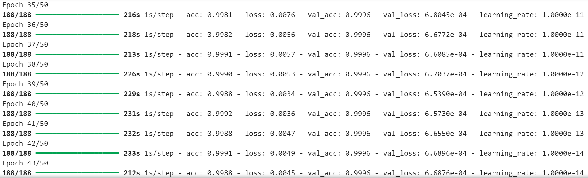

<details>
  <summary>code</summary>

  ```
  # 반복횟수 지정
  # 대문자로 상수를 표기하면 다른 부분에서 변경되지 않는다는 것을 의미
  N_EPOCHS = 50

  # 훈련
  history = model.fit(train_dataset,
                      batch_size=BATCH_SIZE,
                      epochs=N_EPOCHS, 
                      validation_data=validation_dataset,
                      callbacks=[mcp_cb, rlr_cb, ely_cb])
  ```
</details>

<br></br>

### ○ 평가
✔ acc: 0.9986, loss: 0.0080

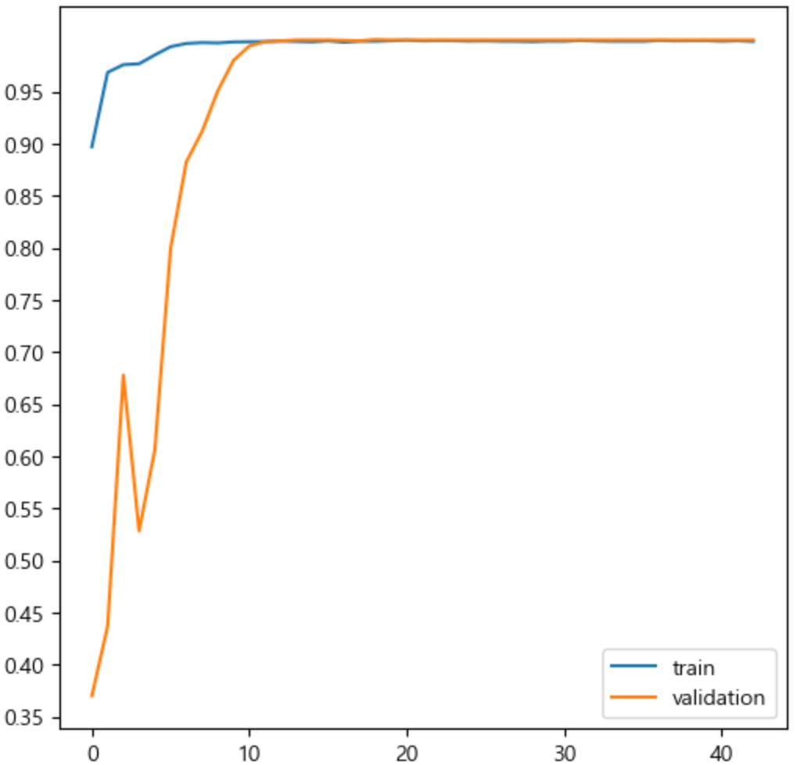

<details>
  <summary>평가 code</summary>

  ```
  # 평가
  model.evaluate(test_dataset, batch_size=BATCH_SIZE)
  ```
</details>
<details>
  <summary>그래프 code</summary>

  ```
  import numpy as np
  import matplotlib.pyplot as plt

  # 학습과정 지표를 그래프화
  def show_history(history):
      plt.figure(figsize=(6, 6))
      plt.yticks(np.arange(0, 1, 0.05))
      plt.plot(history.history['acc'], label='train')
      plt.plot(history.history['val_acc'], label='validation')
      plt.legend()
      
  show_history(history)
  ```
</details>

<br></br>
<br></br>
<br></br>
<br></br>
<br></br>

# Ⅳ. 결론
## 1. 모델 평가


<br>

✔ 모델 성능 비교 결과 정확도가 더 우세한 mobilenet 모델을 채택

<br></br>
<br></br>

## 2. 예측

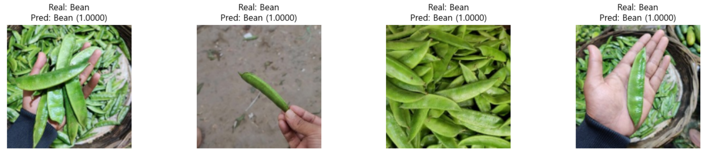
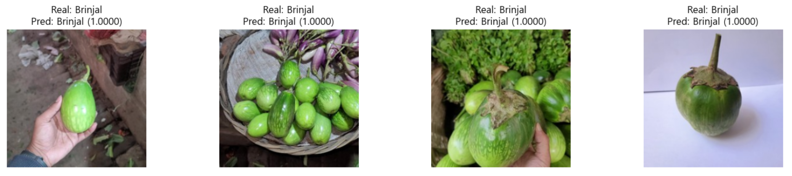
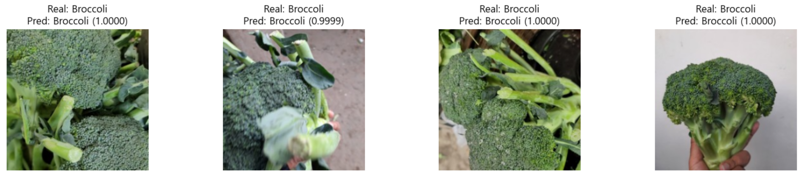

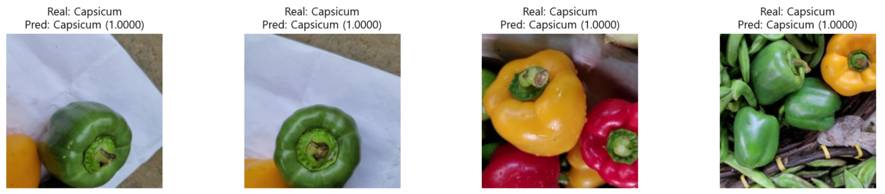
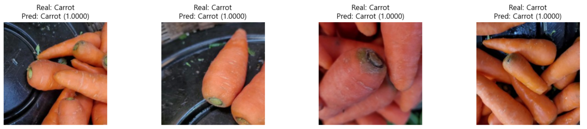
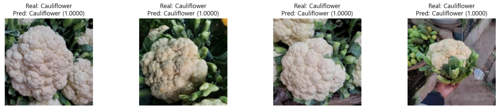
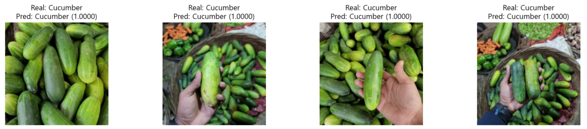
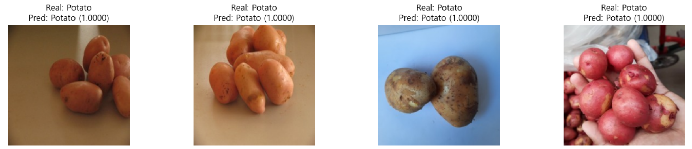
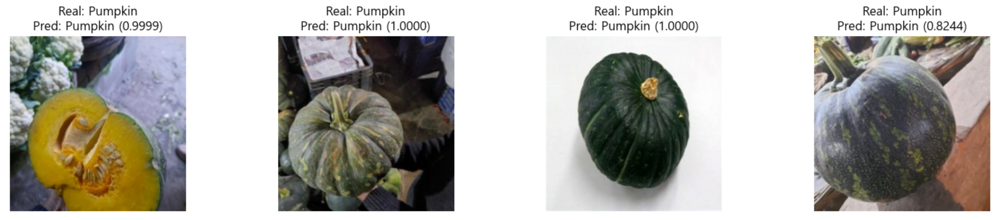
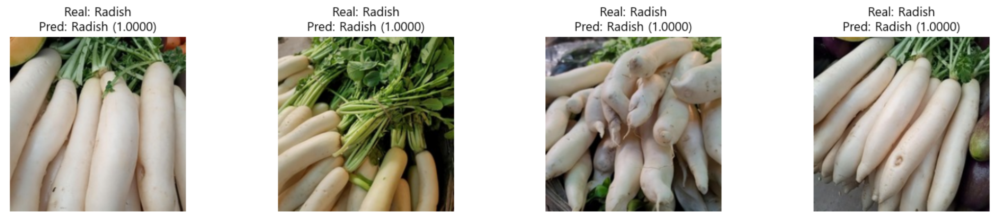
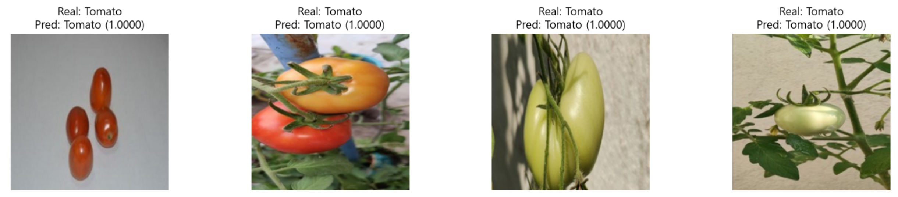

<details>
  <summary>가중치 불러오기 code</summary>

  ```
  from tensorflow.keras.losses import SparseCategoricalCrossentropy, CategoricalCrossentropy
  from tensorflow.keras.optimizers import Adam
  from tensorflow.keras.metrics import Accuracy

  model = create_model(model_name='mobilenet', verbose=True)
  model.load_weights('./callback_files/1cycle/weights.043-0.0007-0.9982.weights.h5')
  model.compile(optimizer=Adam(), loss=CategoricalCrossentropy(), metrics=['acc'])
  ```
</details>
<details>
  <summary>예측 code</summary>

  ```
  import cv2
  import numpy as np
  import matplotlib.pyplot as plt
  from tensorflow.keras.applications.mobilenet import preprocess_input as mobilenet_preprocess_input

  # 클래스 이름 지정
  class_names = ['Bean', 'Brinjal', 'Broccoli', 'Cabbage', 'Capsicum', 'Carrot', 'Cauliflower', 'Cucumber', 'Potato', 'Pumpkin', 'Radish', 'Tomato']

  # 선택할 이미지의 시작 인덱스와 끝 인덱스 지정
  start_index = 10
  end_index = 18

  # 행과 열의 개수 지정
  num_rows = (end_index - start_index + 3) // 4  # +3 ensures rounding up
  num_cols = 4

  # 서브플롯 설정
  fig, axs = plt.subplots(num_rows, num_cols, figsize=(15, num_rows * 3))

  # 시작부터 끝 인덱스까지의 이미지들을 처리
  for idx, i in enumerate(range(start_index, end_index)):
      # 이미지 파일 경로 선택
      selected_file_path = train_file_paths[i]

      # 이미지 로드 및 전처리
      image = cv2.cvtColor(cv2.imread(selected_file_path), cv2.COLOR_BGR2RGB)
      image = cv2.resize(image, (150, 150))
      processed_image = mobilenet_preprocess_input(image.copy())

      # 모델 예측
      predicted_probabilities = model.predict(np.expand_dims(processed_image, axis=0))

      # 예측된 클래스 및 확률 출력
      predicted_class_index = np.argmax(predicted_probabilities)
      predicted_class_name = class_names[predicted_class_index]
      predicted_probability = predicted_probabilities[0][predicted_class_index]

      # 실제 클래스 정보 가져오기
      real_class_index = np.where(train_targets[i])[0][0]  # True 값의 인덱스 가져오기
      real_class_name = class_names[real_class_index]

      # 서브플롯에 이미지와 텍스트 출력
      ax = axs[idx // num_cols, idx % num_cols]
      ax.imshow(image)
      ax.set_title(f"Real: {real_class_name}\nPred: {predicted_class_name} ({predicted_probability:.4f})")
      ax.axis('off')

  # 남은 서브플롯을 비활성화
  for j in range(idx + 1, num_rows * num_cols):
      axs[j // num_cols, j % num_cols].axis('off')

  plt.tight_layout()
  plt.show()
  ```
</details>

<br>

✔ 각 클래스 별로 랜덤한 이미지를 가져와 예측한 결과 정확히 분류되는 것을 확인함