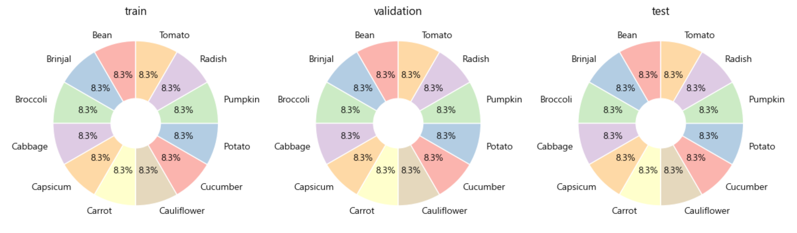
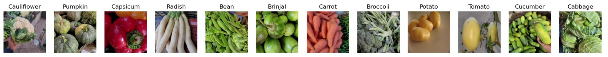
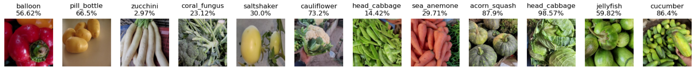
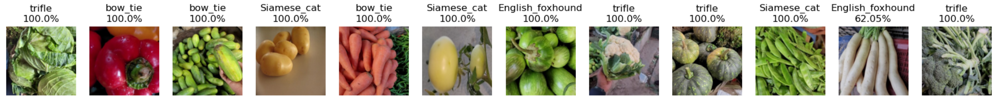
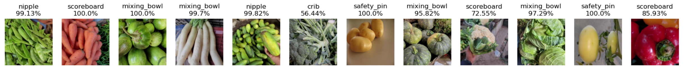
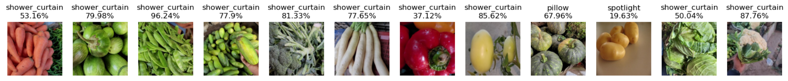
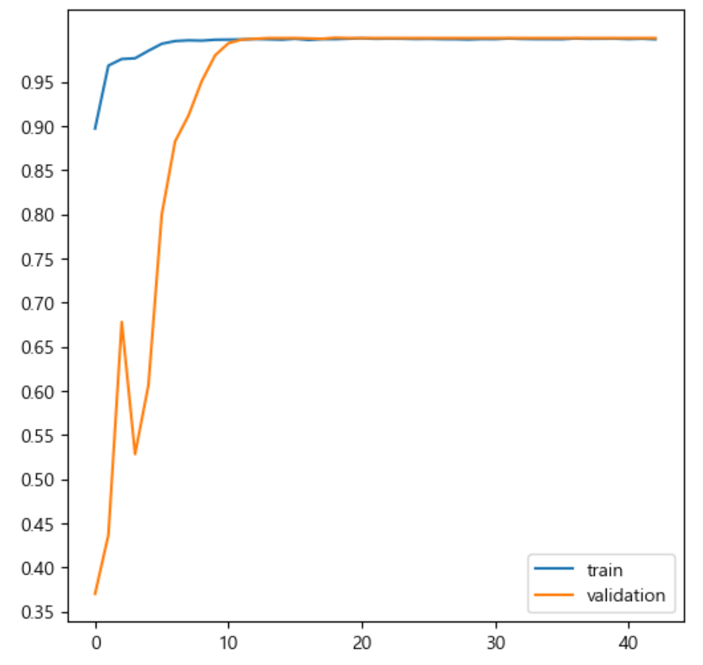
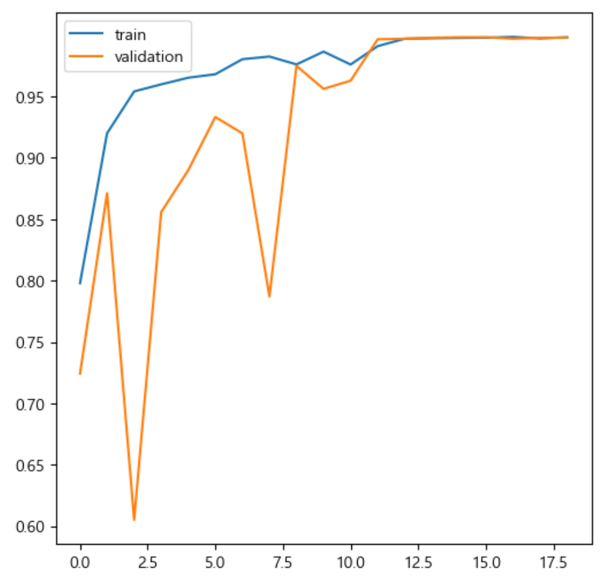
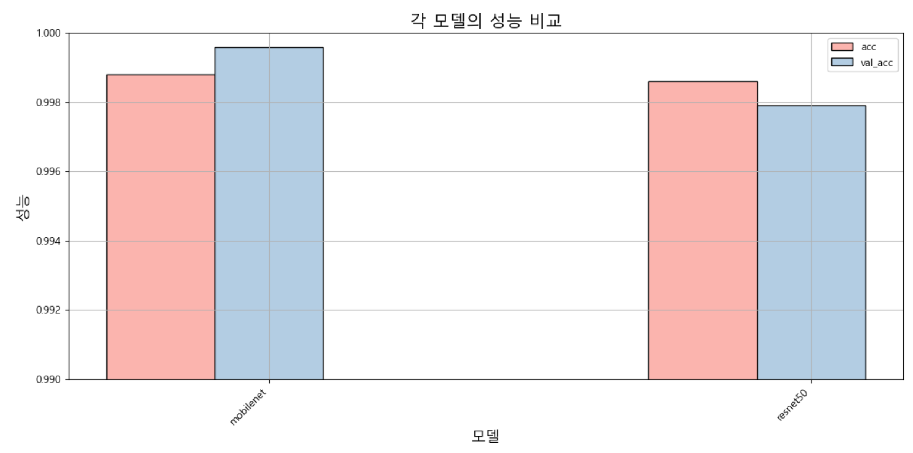

# 🥦 Vegetable Image Dataset <br> &emsp;&ensp; 야채 이미지 분류

## 🥦 목차
1. 개요
2. 유사도 예측
3. 훈련
4. 예측 결과

<br></br>

## 1. 개요
○ 캐글: https://www.kaggle.com/datasets/misrakahmed/vegetable-image-dataset

○ 타겟 개수: 12개
```
0: 'Bean',
1: 'Brinjal',
2: 'Broccoli',
3: 'Cabbage',
4: 'Capsicum',
5: 'Carrot',
6: 'Cauliflower',
7: 'Cucumber',
8: 'Potato',
9: 'Pumpkin',
10: 'Radish',
11: 'Tomato'
```

○ 데이터 세트 개수
- 총 데이터 개수: 16800

- 훈련 데이터 세트
  | 연번 | target_names | count  |
  |:---:|:------------:|:------:|
  | 1  | Bean         | 1000   |
  | 2  | Brinjal      | 1000   |
  | 3  | Broccoli     | 1000 |
  | 4 | Cabbage      | 1000 |
  | 5 | Capsicum     | 1000 |
  | 6 | Carrot       | 1000 |
  | 7 | Cauliflower  | 1000 |
  | 8 | Cucumber     | 1000 |
  | 9 | Potato       | 1000 |
  | 10 | Pumpkin      | 1000 |
  | 11 | Radish       | 1000 |
  | 12 | Tomato       | 1000 |

- 검증 데이터 세트
  | 연번 | target_names | count  |
  |:---:|:------------:|:------:|
  | 1  | Bean         | 200    |
  | 2  | Brinjal      | 200    |
  | 3  | Broccoli     | 200    |
  | 4 | Cabbage      | 200    |
  | 5 | Capsicum     | 200    |
  | 6 | Carrot       | 200    |
  | 7 | Cauliflower  | 200    |
  | 8 | Cucumber     | 200    |
  | 9 | Potato       | 200    |
  | 10 | Pumpkin      | 200    |
  | 11 | Radish       | 200    |
  | 12 | Tomato       | 200    |

- 테스트 데이터 세트
  | 연번 | target_names | count  |
  |:---:|:------------:|:------:|
  | 1  | Bean         | 200    |
  | 2  | Brinjal      | 200    |
  | 3  | Broccoli     | 200    |
  | 4 | Cabbage      | 200    |
  | 5 | Capsicum     | 200    |
  | 6 | Carrot       | 200    |
  | 7 | Cauliflower  | 200    |
  | 8 | Cucumber     | 200    |
  | 9 | Potato       | 200    |
  | 10 | Pumpkin      | 200    |
  | 11 | Radish       | 200    |
  | 12 | Tomato       | 200    |

<br>



<br></br>
<br></br>
<br></br>

## 2. 유사도 예측
○ 정답



<br>

○ vgg16
- 콜리플라워, 양배추, 오이는 유사성이 높지만, 다른 타겟의 유사성은 매우 낮음

  

<br>

○ resnet50
- 유사성이 매우 낮은 것으로 나타남
  
  

<br>

○ xception
- 유사성이 매우 낮은 것으로 나타남

  

<br>

○ mobilenet
- 유사성이 매우 낮은 것으로 나타남

  

<br></br>
<br></br>
<br></br>

## 3. 훈련
○ 이미지 사이즈: 150

○ 배치 사이즈: 64

- 대용량 데이터 세트이기 때문에 이미지 사이즈를 줄이고, 배치 사이즈를 증가함

<br>

○ 모델: 총 2가지
- 시간 효율을 위해 mobilenet과 resnet50 모델을 사용

  | 연번 | model  |
  |:---:|:---------:|
  | 1  | mobilenet   |
  | 2  | resnet50   |

<br>

<details>
  <summary>code</summary>

  ```
  from tensorflow.keras.models import Model
  from tensorflow.keras.layers import Input, Dense , Conv2D , Dropout , Flatten , Activation, MaxPooling2D , GlobalAveragePooling2D
  from tensorflow.keras.layers import BatchNormalization

  from tensorflow.keras.applications import VGG16
  from tensorflow.keras.applications import ResNet50V2
  from tensorflow.keras.applications import Xception
  from tensorflow.keras.applications import MobileNetV2 # 작은 장치에서도 성능을 끌어올릴 수 있는 모델

  # 모델 생성 함수 선언
  # model_name: 사전 훈련 모델 이름, verbose: 모델 요약 출력 여부
  def create_model(model_name='vgg16', verbose=False):
      # Input layer: 이미지 크기와 채널 수를 지정
      input_tensor = Input(shape=(IMAGE_SIZE, IMAGE_SIZE, 3))
      # VGG16 모델 선택
      if model_name == 'vgg16':
          model = VGG16(input_tensor=input_tensor, include_top=False, weights='imagenet')
      # ResNet50V2 모델 선택
      elif model_name == 'resnet50': # ResNet50, 74.9% ; ResNet50V2, 76.0%
          model = ResNet50V2(input_tensor=input_tensor, include_top=False, weights='imagenet')
      # Xception 모델 선택
      elif model_name == 'xception': # Inception을 기초로 한 모델
          model = Xception(input_tensor=input_tensor, include_top=False, weights='imagenet')
      # MobileNetV2 모델 선택
      elif model_name == 'mobilenet':
          model = MobileNetV2(input_tensor=input_tensor, include_top=False, weights='imagenet')

      # output layer: 모델 출력 층 
      x = model.output

      # 분류기
      # GlobalAveragePooling2D: 글로벌 평균 풀링 층을 추가하여 특성 맵의 공간 차원 축소
      x = GlobalAveragePooling2D()(x)
      # hidden layer: VGG16 모델 선택을 선택하지 않았다면 dropout 미진행
      if model_name != 'vgg16':
          x = Dropout(rate=0.5)(x)

      # hidden layer: 50개의 뉴런과 ReLU 활성화 함수 사용
      x = Dense(50, activation='relu')(x)

      # hidden layer: VGG16 모델 선택을 선택하지 않았다면 dropout 미진행
      if model_name != 'vgg16':
          x = Dropout(rate=0.5)(x)

      # output layer: 12개의 뉴런과 활성화 함수를 사용하여 클래스 확률 출력
      output = Dense(12, activation='softmax', name='output')(x)

      # 모델 생성: 입력과 출력을 지정하여 모델 정의
      model = Model(inputs=input_tensor, outputs=output)

      # verbose가 True인 경우 모델 요약 출력
      if verbose:
          model.summary()
      
      return model
  ```
</details>

<br>

○ mobilenet
- Total params: 2,322,646 (8.86 MB)
- Trainable params: 2,288,534 (8.73 MB)
- Non-trainable params: 34,112 (133.25 KB)

<br>

○ resnet50
- Total params: 23,667,862 (90.29 MB)
- Trainable params: 23,622,422 (90.11 MB)
- Non-trainable params: 45,440 (177.50 KB)

<br>

○ 훈련 결과
- mobilenet 성능이 더 우세한 것으로 나타남

| 연번 | model     | acc    | val_acc  |
|:---:|:---------:|:------:|:--------:|
| 1  | mobilenet | 0.9988 | 0.9996   |
| 2  | resnet50  | 0.9986 | 0.9979   |

<br>

<table style="margin: 0 auto; text-align: center;">
  <tr>
    <td style="text-align: center;">mobilenet</td>
    <td style="text-align: center;">resnet50</td>
  </tr>
  <tr>
    <td style="text-align: center; vertical-align: middle;"></td>
    <td style="text-align: center; vertical-align: middle;"></td>
  </tr>
</table>

<br>



<br></br>
<br></br>
<br></br>

## 4. 예측 결과
- 성능이 우세한 mobilenet으로 예측


