# 🐻‍❄️ Bear Character Image Dataset <br> 🐻‍❄️ 곰 캐릭터 이미지 분류

## 🐻‍❄️ 목차
1. 개요
2. 유사도 예측
3. 훈련
4. 예측 결과

<br></br>

## 1. 개요
○ 타겟 개수: 3개
```
0: 'brokenbear', 1: 'Bellygom', 2: 'jokebear'
```

○ 데이터 세트 개수
- 총 데이터 개수: 600

- 훈련 데이터 세트
  | 연번 | target_names | count  |
  |:---:|:------------:|:------:|
  | 1  | brokenbear   | 128    |
  | 2  | Bellygom     | 128    |
  | 3  | jokebear     | 128    |

- 검증 데이터 세트
  | 연번 | target_names | count  |
  |:---:|:------------:|:------:|
  | 1  | brokenbear   | 32    |
  | 2  | Bellygom     | 32    |
  | 3  | jokebear     | 32    |

- 테스트 데이터 세트
  | 연번 | target_names | count  |
  |:---:|:------------:|:------:|
  | 1  | brokenbear   | 40    |
  | 2  | Bellygom     | 40    |
  | 3  | jokebear     | 40    |


<br>

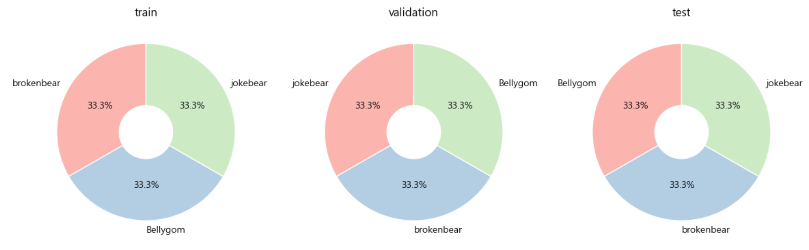

<br></br>
<br></br>
<br></br>

## 2. 유사도 예측
○ 정답

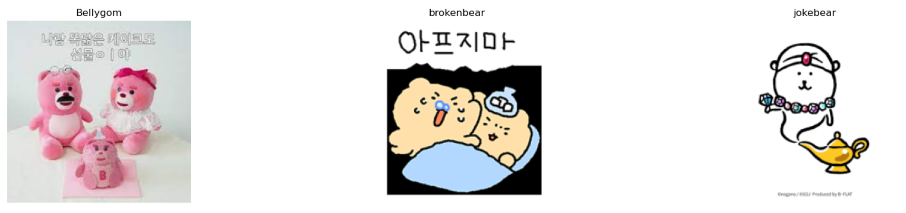

<br>

○ vgg16

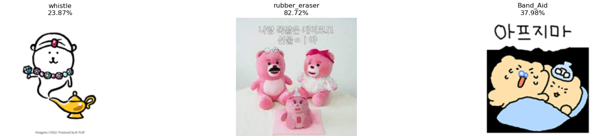

<br>

○ resnet50

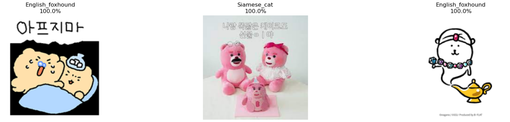

<br>

○ xception

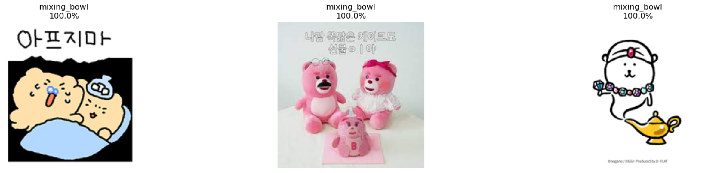

<br>

○ mobilenet

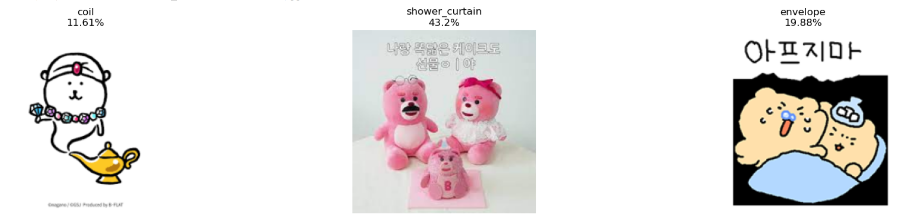

<br></br>
<br></br>
<br></br>

## 3. 훈련
○ 이미지 사이즈: 244

○ 배치 사이즈: 8

- 저용량 데이터 세트이기 때문에 이미지 사이즈를 늘리고, 배치 사이즈를 감소함

<br>

○ 모델: 총 4가지

  | 연번 | model  |
  |:---:|:---------:|
  | 1  | mobilenet   |
  | 2  | resnet50   |
  | 3  | vgg16   |
  | 4  | xception   |

<br>

<details>
  <summary>code</summary>

  ```
  from tensorflow.keras.models import Model
  from tensorflow.keras.layers import Input, Dense , Conv2D , Dropout , Flatten , Activation, MaxPooling2D , GlobalAveragePooling2D
  from tensorflow.keras.layers import BatchNormalization

  from tensorflow.keras.applications import VGG16
  from tensorflow.keras.applications import ResNet50V2
  from tensorflow.keras.applications import Xception
  from tensorflow.keras.applications import MobileNetV2 # 작은 장치에서도 성능을 끌어올릴 수 있는 모델

  # 모델 생성 함수 선언
  # model_name: 사전 훈련 모델 이름, verbose: 모델 요약 출력 여부
  def create_model(model_name='vgg16', verbose=False):
      # Input layer: 이미지 크기와 채널 수를 지정
      input_tensor = Input(shape=(IMAGE_SIZE, IMAGE_SIZE, 3))
      # VGG16 모델 선택
      if model_name == 'vgg16':
          model = VGG16(input_tensor=input_tensor, include_top=False, weights='imagenet')
      # ResNet50V2 모델 선택
      elif model_name == 'resnet50': # ResNet50, 74.9% ; ResNet50V2, 76.0%
          model = ResNet50V2(input_tensor=input_tensor, include_top=False, weights='imagenet')
      # Xception 모델 선택
      elif model_name == 'xception': # Inception을 기초로 한 모델
          model = Xception(input_tensor=input_tensor, include_top=False, weights='imagenet')
      # MobileNetV2 모델 선택
      elif model_name == 'mobilenet':
          model = MobileNetV2(input_tensor=input_tensor, include_top=False, weights='imagenet')

      # output layer: 모델 출력 층 
      x = model.output

      # 분류기
      # GlobalAveragePooling2D: 글로벌 평균 풀링 층을 추가하여 특성 맵의 공간 차원 축소
      x = GlobalAveragePooling2D()(x)
      # hidden layer: VGG16 모델 선택을 선택하지 않았다면 dropout 미진행
      if model_name != 'vgg16':
          x = Dropout(rate=0.5)(x)

      # hidden layer: 뉴런과 ReLU 활성화 함수 사용
      x = Dense(50, activation='relu')(x)

      # hidden layer: VGG16 모델 선택을 선택하지 않았다면 dropout 미진행
      if model_name != 'vgg16':
          x = Dropout(rate=0.5)(x)

      # output layer: 3개의 뉴런과 활성화 함수를 사용하여 클래스 확률 출력
      output = Dense(3, activation='softmax', name='output')(x)

      # 모델 생성: 입력과 출력을 지정하여 모델 정의
      model = Model(inputs=input_tensor, outputs=output)

      # verbose가 True인 경우 모델 요약 출력
      if verbose:
          model.summary()
      
      return model
  ```
</details>

<br>

○ mobilenet
- Total params: 2,322,646 (8.86 MB)
- Trainable params: 2,288,534 (8.73 MB)
- Non-trainable params: 34,112 (133.25 KB)

<br>

○ resnet50
- Total params: 23,667,862 (90.29 MB)
- Trainable params: 23,622,422 (90.11 MB)
- Non-trainable params: 45,440 (177.50 KB)

<br>

○ vgg16
- Total params: 14,740,542 (56.23 MB)
- Trainable params: 14,740,542 (56.23 MB)
- Non-trainable params: 0 (0.00 B)

<br>

○ xception
- Total params: 20,964,134 (79.97 MB)
- Trainable params: 20,909,606 (79.76 MB)
- Non-trainable params: 54,528 (213.00 KB)

<br>

○ 훈련 결과

| 연번 | model     | acc    | val_acc  |
|:---:|:---------:|:------:|:--------:|
| 1  | mobilenet | 0.9004 | 0.7917   |
| 2  | resnet50  | 0.8600 | 0.7708   |
| 3  | vgg16  | 0.9776 | 0.9792   |
| 4  | xception  | 0.9944 | 1.0000   |
| 5  | 미세조정  | 0.9966 | 1.0000   |

<br>

미세 조정 전 시간: 1,292s
미세 조정 후 시간: 458s

<br>

<table style="margin: 0 auto; text-align: center;">
  <tr>
    <td style="text-align: center;">mobilenet</td>
    <td style="text-align: center;">resnet50</td>
    <td style="text-align: center;">vgg16</td>
    <td style="text-align: center;">xception</td>
    <td style="text-align: center;">미세조정</td>
  </tr>
  <tr>
    <td style="text-align: center; vertical-align: middle;"></td>
    <td style="text-align: center; vertical-align: middle;"></td>
    <td style="text-align: center; vertical-align: middle;">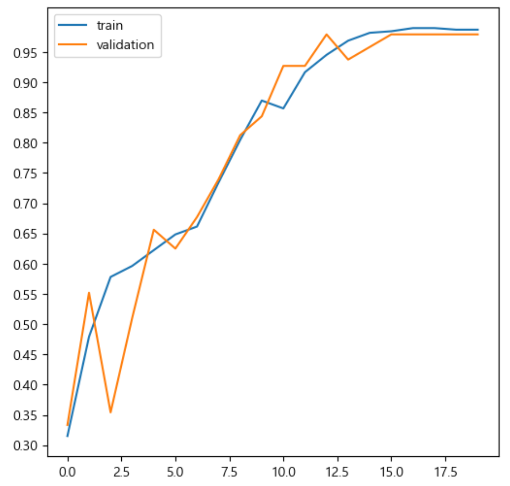</td>
    <td style="text-align: center; vertical-align: middle;">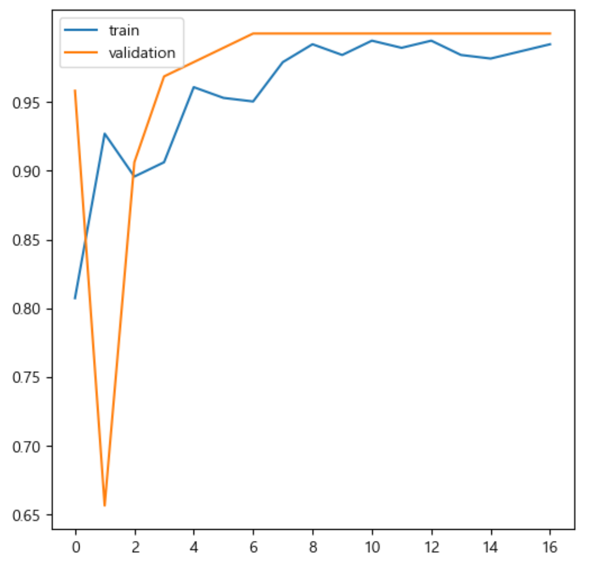</td>
    <td style="text-align: center; vertical-align: middle;">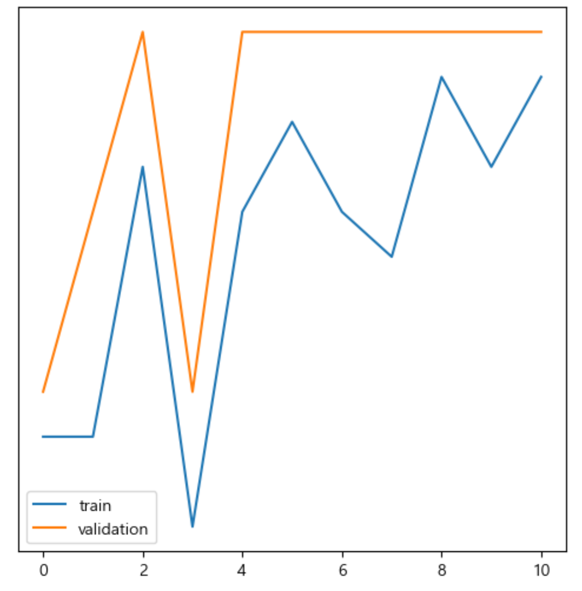</td>
  </tr>
</table>

<br>

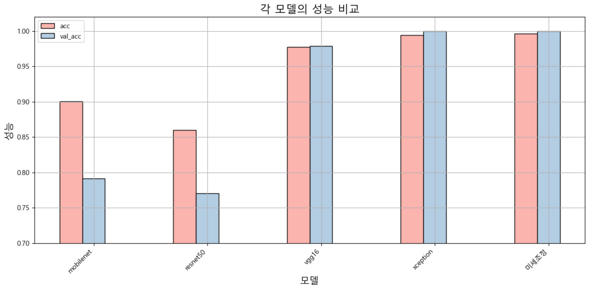

<br></br>
<br></br>
<br></br>

## 4. 예측 결과

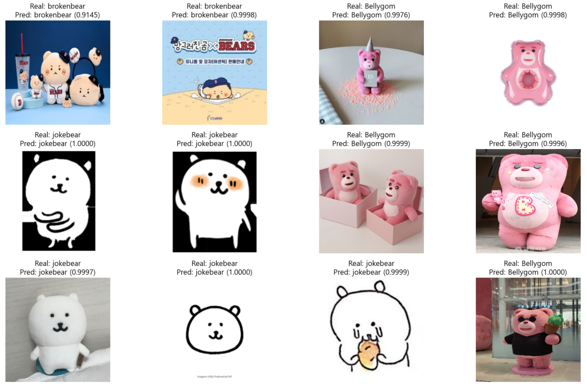
